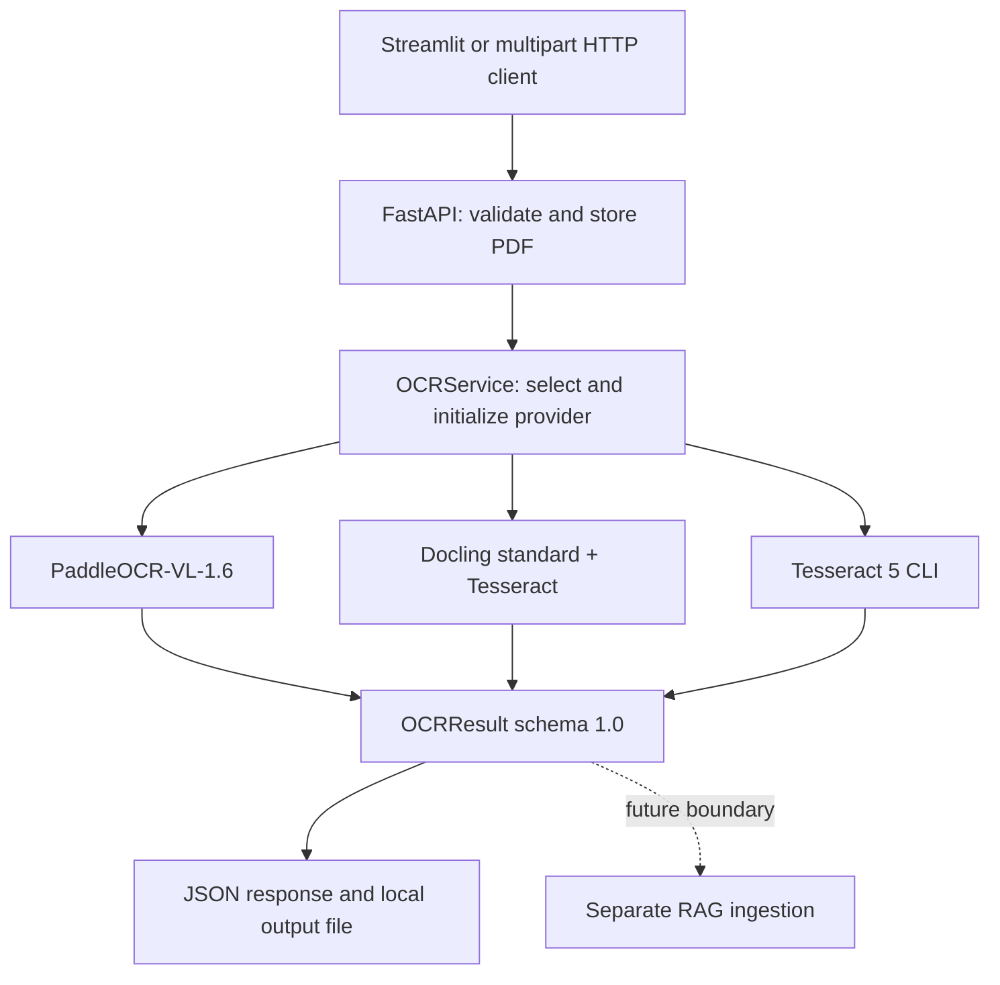

# OCR Benchmarking / OCR Service

## Overview

### Windows launcher

Double-click `run_app.bat`. The launcher prefers `.venv-ocr`, then other working
Python environments, and skips stale environments whose base Python was removed.
Keep the launcher window open while using the app at http://127.0.0.1:8501.
Use `run_app.bat -CheckOnly` for dependency/path checks or
`run_app.bat -SmokeCheck` to start and stop both services without opening a browser.

On a normal launch, if the pinned Paddle/Docling packages or their local model
files are missing, the launcher offers to install `requirements-models.txt` and
download both providers' assets. `-CheckOnly` and `-SmokeCheck` do not install
optional model packages or download weights.

Set `OCR_POPPLER_PATH=C:\poppler-26.02.0` in `.env` only once. The application
resolves the installation root to `Library/bin`; a later duplicate setting would
override the correct path.

The explicit model download and real extraction checks are:

```powershell
.venv-ocr\Scripts\python.exe scripts\provision_models.py
.venv-ocr\Scripts\python.exe scripts\check_models.py
```

Downloads are saved under `models/`. The check uses a small scanned invoice and
saves results under `runtime/model-check/`; it fails if a provider cannot extract
the expected amount. It requires installed model packages and native runtimes.
Use `--provider tesseract`, `--provider docling`, or `--provider paddle_vl` with
the check script to diagnose one provider.

For a fresh CPU environment, install `requirements-windows-cpu.txt` before
provisioning. `requirements-windows-cpu.lock.txt` records the exact installed
Windows/Python 3.13 package versions, including development dependencies.

Verification on 2026-10-05: launcher preflight and API/Streamlit startup passed;
96 tests passed. Real scanned-PDF extraction passed separately for all three
providers. On this 8 GB RAM CPU machine, cold runs took approximately 0.7 seconds
for Tesseract, 27 seconds for Docling, and 381 seconds for PaddleOCR-VL (including
model loading). Large documents may take substantially longer. Switching
providers releases the previous model pipeline before loading the next one;
switching back reloads its weights. English recognition was tested; the installed
Tesseract language packs are `eng` and `osd`. Arabic Tesseract/Docling recognition
still requires the `ara` language pack. The older refactor milestone notes below
describe the state before this machine setup and verification.

A local PDF OCR service with FastAPI, a Streamlit client, and preserved English, Arabic, and mixed-language benchmarks. Three provider adapters return the same versioned document format, including available page/block provenance, source identity, warnings, and errors.

The application and API are covered by **94 passing tests** (2026-10-01). OCR models are mocked in these tests. Actual model accuracy, a fresh full model installation, GPU execution, and real Poppler/Tesseract extraction have **not** been validated in this milestone. No RAG pipeline is implemented.

## Architecture



Models load on the first extraction for that provider, never during construction or API startup. Health reads known state without inference. One process serializes inference with a lock; blocking OCR runs outside the API event loop. There are no queues, databases, external OCR services, or automatic provider substitutions.

## Supported OCR Providers

| API ID | Purpose and strengths | Limitations | Hardware / CPU / GPU |
| --- | --- | --- | --- |
| `paddle_vl` | PaddleOCR-VL-1.6-0.9B with PP-DocLayoutV3; multilingual scans, layout, tables, provider Markdown and block boxes | Can omit/hallucinate text; Arabic/RTL accuracy unmeasured here. No invented OCR confidence. Image rotation/unwarping, chart/seal recognition, and cross-page restructuring are disabled in this adapter. | Local native Paddle backend; CPU default, `gpu:0` configurable. Requires VL/layout assets, Paddle runtime, Poppler. Plan roughly 16 GB RAM and 6–8 GB VRAM for initial GPU trials; these are estimates, not measured minimums. |
| `docling` | Standard PDF pipeline with Tesseract CLI OCR; native PDF text, hierarchy, structured tables, item/page provenance | Not Granite-Docling or EasyOCR. Table/RTL errors remain possible. Multi-page table cells without page attribution stay in raw metadata/Markdown instead of being assigned fabricated page text. | CPU default; `cuda:0` may accelerate applicable Torch components. Tesseract remains CPU-based. Requires local layout/table assets and Tesseract; no Poppler needed for this path. Plan 8–16 GB RAM; optional GPU capacity depends on documents/models. |
| `tesseract` | Tesseract 5 CLI; lightweight fallback/reference, TSV word hierarchy, boxes and original confidence | Weak on complex tables, poor scans and mixed-script reading order. No semantic table reconstruction or true Markdown. | CPU only; no GPU/model Python framework required. Needs Tesseract, language packs and Poppler. Sequential pages limit memory; large page dimensions still consume substantial RAM. |

These are three complementary providers, with Tesseract reused by Docling. `tesseract` is the safe default to avoid implicitly loading the largest model. The intended richer multilingual provider remains `paddle_vl`.

Paddle's native CPU/GPU support and runtime requirements are described in its [official usage guide](https://www.paddleocr.ai/latest/en/version3.x/pipeline_usage/PaddleOCR-VL.html). See also [Docling offline configuration](https://docling-project.github.io/docling/usage/advanced_options/) and [Tesseract documentation](https://tesseract-ocr.github.io/tessdoc/).

## Project Structure

```text
OCR/                    Active package: API, settings, service, schemas, PDF helpers
  providers/            Common interface and three selected adapters
benchmarks/
  datasets/             Original PDFs and Markdown_Reference: English, Arabic, Mix
  outputs/              Preserved historical outputs; separate new run directories
  results/              Preserved XLSX files; new results default to runs/
  evaluation/           Language-specific WER/CER evaluators and diagnostics
  legacy/               Eight original runners and original API/dependency/launcher snapshots
  notebooks/            Preserved benchmark notebooks (historical paths/environments)
experiments/             Preserved setup notebooks and Surya diagnostics
runtime/                 Uploads, normalized JSON outputs, temporary/test artifacts
tests/                  Unit, contract, API and fixture benchmark tests; legacy/ checks
docs/                   Final report, handoff, schema, migration evidence, research document
Agentic_RAG/             Untouched placeholder; not part of OCR runtime
```

`OCR/.python-version`, nested ignore rules, old virtual environments and empty moved-from directories remain historical leftovers. The launcher uses the **root** `.venv`. Notebook saved outputs and environments are historical records, not setup instructions.

## Requirements

- Application syntax/dependency targets: Python **3.10–3.13**, 64-bit. The suite actually ran on **Python 3.13.7**. Use **Python 3.11 x64** as a conservative starting point for a new Windows model environment; the full optional stack has not been validated locally on it.
- Windows PowerShell or Command Prompt. Core installation needs the packages in `requirements.txt`; tests/evaluation use `requirements-dev.txt`.
- Tesseract **5.x** plus `eng` traineddata; install `ara` as well for `ara+eng`. Both Tesseract-backed providers require these assets. Follow the Windows distribution link from [Tesseract installation guidance](https://tesseract-ocr.github.io/tessdoc/Installation.html).
- Poppler `pdfinfo` and `pdftoppm` for Tesseract/Paddle PDF rendering. Install a Windows build and put its binary directory on PATH or set `OCR_POPPLER_PATH`. See [pdf2image installation](https://pdf2image.readthedocs.io/en/latest/installation.html).
- Optional models: `requirements-models.txt` targets PaddleOCR **3.6.0** and Docling **2.80.0**. These are integration targets, not a resolved, locally verified lockfile. Their transitive dependencies may need compatibility work on Windows.
- GPU is optional. Paddle GPU installation must match the GPU/CUDA wheel; do not install CPU and GPU Paddle distributions together. Docling GPU execution requires a compatible Torch build. No GPU is needed for unit tests.

## Installation

Run these commands from the repository root in a **fresh checkout/environment**, with the intended Python selected:

```powershell
python --version
python -m venv .venv
.\.venv\Scripts\Activate.ps1
python -m pip install -r requirements.txt
python -m pip install -r requirements-dev.txt
```

If multiple Python versions are installed, use `py -3.11 -m venv .venv` instead of the venv command above. In **Command Prompt**, activate with:

```bat
.venv\Scripts\activate.bat
```

If PowerShell blocks activation, use `.\.venv\Scripts\python.exe` in place of `python`; activation is not required. Existing virtual environments from another Python installation must not be assumed valid. This refactor did not repair the pre-existing environments.

For the optional selected model providers, install their packages explicitly:

```powershell
python -m pip install -r requirements-models.txt
```

For local Paddle CPU inference, the upstream guide gives this runtime installation:

```powershell
python -m pip install paddlepaddle==3.2.1 -i https://www.paddlepaddle.org.cn/packages/stable/cpu/
```

For GPU inference, select the matching GPU wheel from the official Paddle installation guide instead. The pre-existing Paddle 3.0.0 environment is below the documented native VL runtime requirement. No Paddle upgrade was performed by this refactor.

Model provisioning is a separate, intentional download step. **The API never provisions assets for you.** In the activated model environment, download Docling's layout and standard table assets:

```powershell
docling-tools models download layout tableformer --output-dir models/docling
```

This command follows the pinned [Docling model CLI](https://github.com/docling-project/docling/blob/v2.80.0/docling/cli/models.py). Configure `OCR_DOCLING_ARTIFACTS_PATH=models/docling` afterward.

Paddle's official model repositories are [PaddleOCR-VL-1.6](https://huggingface.co/PaddlePaddle/PaddleOCR-VL-1.6/tree/main) and [PP-DocLayoutV3](https://huggingface.co/PaddlePaddle/PP-DocLayoutV3/tree/main). The model packages supply `huggingface_hub`; an explicit download can be made with:

```powershell
python -c "from huggingface_hub import snapshot_download; snapshot_download('PaddlePaddle/PaddleOCR-VL-1.6', local_dir='models/PaddleOCR-VL-1.6')"
python -c "from huggingface_hub import snapshot_download; snapshot_download('PaddlePaddle/PP-DocLayoutV3', local_dir='models/PP-DocLayoutV3')"
```

These commands download model files and were **not run** during this refactor. Record the actual repository commit revisions used; for reproducible provisioning, pass each verified commit as `revision=`. The VL directory needs its complete model/config/tokenizer files, including `inference.yml`; the native layout directory needs `inference.json`, `inference.pdiparams` and `inference.yml`. Point the two Paddle environment settings to these directories. Arbitrary empty folders do not satisfy asset requirements.

Adapters set Hugging Face offline flags before loading model libraries, supply local asset paths, disable remote Docling services, and disable Paddle model-source checks and unused preprocessing models. A full offline model smoke test is still outstanding; these flags are not an OS-level network sandbox.

## Environment Configuration

Copy the template and edit the copy:

```powershell
Copy-Item .env.example .env
```

`load_settings()` reads the repository-root `.env` without modifying the process environment. Existing environment variables take precedence. Relative directory paths resolve against the repository root, regardless of the working directory. `.env` is ignored by Git and needs no API keys. Leave unused optional paths commented out; an empty path is invalid.

| Setting | Default | Meaning |
| --- | --- | --- |
| `OCR_PROVIDER` | `tesseract` | Default provider when multipart `engine` is omitted |
| `OCR_UPLOAD_DIR` | `runtime/uploads` | Retained input PDFs |
| `OCR_TEMP_DIR` | `runtime/tmp` | Application upload staging and Tesseract page PNGs |
| `OCR_OUTPUT_DIR` | `runtime/outputs` | Persisted normalized result JSON |
| `OCR_PDF_DPI` | `300` | Shared Tesseract/Paddle rendering DPI; not Docling's native pipeline resolution |
| `OCR_POPPLER_PATH` | unset | Optional Poppler binary directory; otherwise PATH |
| `OCR_TESSERACT_CMD` | `tesseract` | Executable on PATH or an explicit executable path |
| `OCR_TESSERACT_LANG` | `eng` | Tesseract languages, e.g. `ara+eng`, including the Docling OCR backend |
| `OCR_API_HOST` | `127.0.0.1` | Bind address for `python -m OCR` |
| `OCR_API_PORT` | `8000` | Bind port for `python -m OCR` |
| `OCR_API_URL` | `http://127.0.0.1:8000` | Streamlit's API address; update it if host/port change |
| `OCR_MAX_UPLOAD_BYTES` | `52428800` | Maximum PDF bytes (50 MiB); multipart body limit adds 1 MiB overhead |
| `OCR_MAX_PAGES` | `100` | Maximum PDF pages |
| `OCR_OPERATION_TIMEOUT` | `120` | Seconds for Poppler/Tesseract operations and Docling document timeout; **not** a hard Paddle inference or whole-request deadline |
| `OCR_PADDLE_VL_MODEL_DIR` | unset | Complete local VL-1.6 assets |
| `OCR_PADDLE_LAYOUT_MODEL_DIR` | unset | Complete local PP-DocLayoutV3 assets |
| `OCR_PADDLE_MODEL_REVISION` | unset | Operator-recorded asset revision; not automatically verified |
| `OCR_PADDLE_DEVICE` | `cpu` | Native Paddle device, e.g. `gpu:0` |
| `OCR_DOCLING_ARTIFACTS_PATH` | unset | Local Docling model bundle |
| `OCR_DOCLING_MODEL_REVISION` | unset | Operator-recorded bundle revision; not automatically verified |
| `OCR_DOCLING_DEVICE` | `cpu` | Docling device, e.g. `cuda:0` |

Configured recognition languages are recorded as configuration metadata, never as detected document language. Model/page/block fields unsupported by a provider remain null.

## Running the API

From the repository root:

```powershell
python -m OCR
```

This reads `OCR_API_HOST`/`OCR_API_PORT`. The equivalent explicit Uvicorn entry point is:

```powershell
python -m uvicorn OCR.app:app --host 127.0.0.1 --port 8000
```

The explicit Uvicorn command's host/port arguments control binding; it does not use those two settings automatically. Use one worker for the current in-process inference policy. API documentation is at `http://127.0.0.1:8000/docs`.

## Running Streamlit

In a second activated terminal at the repository root:

```powershell
python -m streamlit run OCR/streamlit_app.py --server.address 127.0.0.1
```

The UI uses `OCR_API_URL`, discovers current provider IDs from `/tools`, supports single/all-provider extraction, and downloads normalized JSON and available Markdown. Root `run_app.bat` opens both processes using root `.venv`; the launcher and live UI were source-reviewed, not interactively exercised in this milestone.

## Using the API

Use `curl.exe` explicitly on Windows to avoid PowerShell's older `curl` alias:

```powershell
curl.exe http://127.0.0.1:8000/health
curl.exe http://127.0.0.1:8000/tools
curl.exe -X POST http://127.0.0.1:8000/extract -F "engine=tesseract" -F "file=@benchmarks/datasets/English/Dataset/crowd_1.pdf;type=application/pdf"
curl.exe -X POST http://127.0.0.1:8000/extract/compare -F "file=@benchmarks/datasets/English/Dataset/crowd_1.pdf;type=application/pdf"
```

`POST /extract` accepts multipart `file` plus optional `engine`, and returns **OCRResult directly**. The old `{engine, filename, markdown}` response and JSON `pdf_path` request are obsolete. The version is `schema_version: "1.0"`; see [the JSON Schema](docs/ocr-result.schema.json).

`POST /extract/compare` stores the PDF once and returns `{document_id, filename, results}`. Each entry has `{provider, result, errors}`. An unavailable provider has `result: null` and structured errors; HTTP 200 does not mean every comparison succeeded. Successful extraction with recoverable page errors also returns HTTP 200: inspect `errors` at document and page levels.

Errors: **400** invalid PDF/name/provider; **413** size limit; **422** malformed/missing multipart fields; **503** unavailable dependencies/provider initialization; **500** fatal extraction/storage failure. Application OCR errors use `detail: {code, message, provider}`; standard FastAPI validation errors keep FastAPI's validation format. PDF-header checking is only an early filter; the parser performs actual document validation.

`/health` returning `status: ok` means the API responds. Each provider independently reports `uninitialized`, `ready`, or `unavailable`. Health does not load missing models. `/tools` lists supported integrations, not guaranteed installed models.

## Running OCR

Select `engine=tesseract`, `engine=docling`, or `engine=paddle_vl` in the multipart request or select it in Streamlit. Set `OCR_PROVIDER` to change the default. For Arabic/mixed scans with either Tesseract-backed path, configure `OCR_TESSERACT_LANG=ara+eng` and install both language packs before starting the API. Paddle multilingual recognition does not use that Tesseract language setting.

A direct Python caller may construct `Settings`, `OCRDocument`, and a provider, then call `initialize()` followed by `extract(document)`. Constructors and `health()` do not initialize models. `OCRService` adds provider selection, provenance checking and JSON persistence; direct adapter calls do not persist results.

## Running Benchmarks

Historical files remain under `benchmarks/datasets`, `benchmarks/outputs` and `benchmarks/results`. Language folders are exactly `English`, `Arabic`, and **`Mix`**.

Evaluate existing output with the preserved language-specific normalization and WER/CER policy:

```powershell
python -m benchmarks.evaluation.evaluate_english --ocr-output benchmarks/outputs/English/baiduocr
python -m benchmarks.evaluation.evaluate_arabic --ocr-output benchmarks/outputs/Arabic/tesseractocr
python -m benchmarks.evaluation.evaluate_mix --ocr-output benchmarks/outputs/Mix/markerocr
```

Those historical provider defaults deliberately match the old scripts. Baidu outputs are historical artifacts; Baidu is not an application provider. Evaluators write a fresh, uniquely named XLSX under `benchmarks/results/runs/`. Optional `--reference PATH` and `--result NEW_FILE.xlsx` arguments override paths; an existing result file is rejected. Missing output files are reported and skipped, as in the original scripts. No matches produce an explicit error. These are unweighted means of per-file metrics; historical cleanup can remove meaningful text and should not be mistaken for a new accuracy policy.

Generate new OCR output only after provisioning the selected provider:

```powershell
python -m benchmarks.run --language English --provider tesseract --output-dir benchmarks/outputs/English/tesseract-new-run
python -m benchmarks.run --language Arabic --provider paddle_vl --output-dir benchmarks/outputs/Arabic/paddle-vl-1.6-new-run
python -m benchmarks.run --language Mix --provider docling --output-dir benchmarks/outputs/Mix/docling-tesseract-new-run
```

Each output directory must be new. Omit `--output-dir` for a provider/timestamp/UUID directory. Runs save a manifest, normalized JSON and `.md` files containing provider Markdown when available, otherwise OCR text. Failed/partial documents are recorded in the manifest and excluded from Markdown scoring; check the failure count so a partial run is not presented as full-dataset accuracy. Point the matching evaluator's `--ocr-output` at the new directory. Never label VL-1.6 output as conventional legacy PaddleOCR.

The preserved notebooks contain historical/Colab paths and setup cells. Use the current module commands above; do not execute installation notebooks as the application setup workflow.

## Running Tests

Install `requirements-dev.txt`, then from the repository root:

```powershell
python -B -m pytest tests -q -p no:cacheprovider
```

The approved recorded run also used `--basetemp=runtime/test-tmp-20261001 --junitxml=runtime/test-results.xml`. Pytest can clear its `--basetemp` on reuse; use only a dedicated test directory. Tests mock heavyweight models and do not download them, invoke real OCR binaries, or process historical datasets. Fixture evaluators create only temporary XLSX files.

Recorded result: **94 passed, 0 failed, 0 skipped, no warnings emitted**, 2.37 seconds. See [test evidence](docs/OCR_TEST_RESULTS.json) and [the final report](docs/OCR_REFACTOR_REPORT.md). A passing mocked suite is not a model-backed acceptance result.

## Outputs

| Artifact | Default location / behavior |
| --- | --- |
| Uploaded PDFs | `runtime/uploads/<generated-id>.pdf`; original filename and SHA-256 retained in metadata. Six pre-existing uploads remain under their original names. |
| Normalized OCR results | `runtime/outputs/<generated-id>.json`; new file per successful/partial extraction, no overwrite. Document ID is the input SHA-256 for HTTP uploads and benchmark runs. |
| Temporary application files | `runtime/tmp`; staging and Tesseract temporary PNGs are context-managed. Multipart spooling and third-party model libraries may also use OS temp/cache locations. |
| Benchmark OCR | `benchmarks/outputs/<language>/<new-run>/`; manifest plus normalized JSON and scoring Markdown. |
| Benchmark evaluation | `benchmarks/results/runs/<timestamp-id>.xlsx`, or explicit fresh `--result`. |
| Test evidence | JUnit/fixtures under `runtime/` for the recorded command; durable summary under `docs/`. |

Uploads and results are retained; there is no automatic retention cleanup or retrieval/download API. Generated runtime files, `.env` and model directories are ignored by Git. The six preserved uploads have explicit ignore exceptions so migration does not hide previously present files from a later commit. No files were staged or committed by the refactor.

## Future RAG Integration

The boundary is **OCR -> OCRResult schema 1.0 -> separate future ingestion**. RAG should validate the schema, preserve the original result artifact, and carry document/provider/page/block IDs and exact text spans forward. Page spans address `result.text`; block spans address `page.text`; offsets use Unicode characters and half-open ranges, not UTF-8 bytes or UTF-16 indices. Geometry carries explicit units and origin. Unknown block structure stays null.

RAG will own semantic cleanup, chunking, embeddings, vector storage, retrieval, reranking, LangGraph, generation and citation rendering. None is implemented or imported by OCR. The first proposed RAG task is a standalone ingestion-contract validator and citation round-trip fixture, after explicit approval.

## Troubleshooting

- **Python cannot start / stale `.venv`:** verify the selected base Python and `.venv/pyvenv.cfg`. Use a fresh environment with an installed interpreter. The historical `OCR/.python-version` does not configure root launch commands.
- **PowerShell activation fails:** call `.venv\Scripts\python.exe` directly, or activate with `activate.bat` in Command Prompt.
- **Multipart dependency error:** install the current core requirements in the same interpreter used to launch Uvicorn. Use `python -m pip`, not an unrelated `pip` executable.
- **Poppler unavailable:** verify `pdfinfo -v` and `pdftoppm -v`, or point `OCR_POPPLER_PATH` at their binary directory. Poppler is unnecessary for the Docling provider.
- **Tesseract unavailable/language missing:** verify `tesseract --version` (5.x) and `tesseract --list-langs`; install the configured traineddata and check executable discovery. `ara+eng` requires both packs.
- **Model initialization returns 503:** inspect server logs. Ensure optional packages and complete local assets exist; inspect `/health`. An empty/nonexistent asset directory fails explicitly. No alternate provider is silently used.
- **Windows model wheel/DLL or GPU errors:** confirm Python architecture, wheel availability, CUDA/driver/Torch/Paddle compatibility and local assets. The full optional Windows stack remains unverified; CPU settings are available, but CPU may be slow. Do not use the old setup notebooks to repair the current environment.
- **Long Paddle request:** the current native adapter has no enforced inference deadline/cancellation. Reduce PDF size/page count or use smaller validation documents before batch runs.
- **413 / page-limit rejection:** check `OCR_MAX_UPLOAD_BYTES`/`OCR_MAX_PAGES`. Limits are resource controls, not evidence that a PDF is safe or accurately recognized.
- **UI cannot reach API:** start `python -m OCR` first and match `OCR_API_URL` to its address. A ready API can still have uninitialized/unavailable providers.
- **Benchmark results differ from expectations:** verify the exact provider/model/revision and export field, configured language packs, failed documents, and historical normalization policy. Local Arabic/English/mixed accuracy has not been measured for the new adapters.
